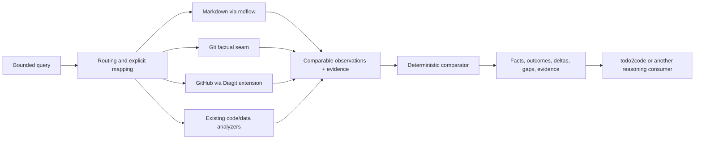

# data2dsl

`data2dsl` is a planned, evidence-first comparison layer. It will turn facts
from existing data sources into comparable observations and deterministic
differences that other systems can reason about.

The short version:

> Ask one bounded question, acquire the relevant facts from two or more
> sources, normalize them without losing provenance, compare like with like,
> and return the result together with evidence.

The project is currently in contract and integration planning. The repository
contains governance, capability evidence and architectural decisions, but no
functional product implementation or final public DSL yet.

## The problem

Useful facts already exist across Markdown documents, Git repositories, GitHub,
configuration files, code analyzers and browser-backed sources. Each source has
its own structure and vocabulary. Today a consumer such as `todo2code` must
either understand every source or rely on an LLM to interpret incomparable
outputs.

That creates four recurring problems:

1. the same metric can be named or represented differently by each source;
2. values may refer to different actors, repositories or time windows;
3. conclusions can lose the evidence needed to verify them;
4. source acquisition, deterministic comparison and higher-level reasoning get
   mixed into one component.

`data2dsl` is intended to provide the missing factual boundary between source
tools and reasoning consumers.

## Who it is for

The primary consumers are programs and agents that need to compare claims with
observed data while preserving provenance. Initial consumers are expected to
include `todo2code` and repository-governance workflows, but the core must not
depend on either one.

A human may formulate the question, inspect the differences and follow the
evidence. A source adapter acquires facts. `data2dsl` normalizes and compares
them. A separate consumer decides what the result means or what action, if any,
should follow.

## Golden case

The first end-to-end case is:

> Compare statements in `work-summary.md` with actual GitHub activity for the
> same repository, actor, metric and time window.

For example, a summary might claim 12 commits for a person during a given
week, while the GitHub source reports 10. The planned result is not prose or an
LLM verdict. It is an evidence-bearing comparison containing, conceptually:

| Field | Example |
| --- | --- |
| Subject | repository and actor |
| Metric | commit count |
| Window | explicit start and end |
| Left observation | claimed value from a Markdown location |
| Right observation | measured value from GitHub pages/API results |
| Outcome | `CONFLICT` |
| Delta | `-2` |
| Evidence | immutable references and content digests for both sides |

This table illustrates intended behavior; it is not a final API or schema.

## Planned inputs

A bounded comparison needs three kinds of input:

- a query describing the subject, metric, sources and time window;
- source locations and the authority or credentials needed by their existing
  adapters;
- explicit mapping/comparison rules when source vocabularies differ.

Natural-language interpretation may help construct a query, but it must not
silently change the metric, window or source identity. Unresolved ambiguity
must remain visible.

## Planned outputs

The factual output should contain:

- normalized source observations with stable identity and source state;
- deterministic scalar or set comparisons;
- outcomes such as `MATCH`, `CONFLICT`, `MISSING_LEFT`, `MISSING_RIGHT` and
  `UNEVALUABLE`;
- typed deltas where a delta is meaningful;
- evidence references sufficient to locate, integrity-check and reproduce the
  source facts;
- explicit gaps when acquisition, mapping or comparison cannot be completed.

`UNEVALUABLE` is not success and missing data is not zero. Comparison outcomes
are also distinct from the state of an individual observation.

## Planned composition

This is a composition hypothesis, not a final runtime contract. Current
reuse decisions and their pinned evidence are recorded in
[`docs/CAPABILITY_MAP.md`](docs/CAPABILITY_MAP.md).

## What data2dsl owns

The project should own only the smallest missing responsibilities:

- routing a bounded query to declared source capabilities;
- explicit mapping from source facts to comparable metric keys;
- normalization that preserves source identity, time and evidence;
- deterministic comparability checks and scalar/set differences;
- a thin adapter boundary for existing source tools;
- factual results and typed gaps for downstream consumers.

## What data2dsl does not own

The project is not intended to become:

- a universal parser framework;
- a replacement Git or GitHub client;
- a replacement for `mdflow`, Diagit, code analyzers or `todo2code`;
- an LLM reasoning or conclusion engine;
- an autonomous enforcement or mutation system;
- a Digital Twin event store or all-traits Twin runtime;
- a place to copy code from neighboring repositories without an explicit,
  compatibility-tested extraction decision.

Source adapters remain responsible for truthful acquisition. Standards owners
remain responsible for shared contracts. Consumers remain responsible for
reasoning, policy and action.

## Reuse-first strategy

Every capability follows this order:

1. **REUSE** an existing public API or CLI when its behavior and ownership fit.
2. **EXTRACT** the smallest neutral seam when useful behavior is trapped inside
   another product; preserve its language and compatibility.
3. **EXTEND** the established owning component when a nearby capability exists.
4. Mark a capability **MISSING** and implement it locally only after the first
   three options have been disproved with current evidence.

Examples from the Phase 0 inventory include reusing `mdflow` for Markdown
structure, extending Diagit's established GitHub boundary for commit metrics,
and keeping `todo2code` as a reasoning consumer rather than moving its policy
into data2dsl.

## Delivery roadmap

The planned delivery order is dependency-driven:

1. decide the observation/evidence contract and its compatibility with
   `subactor/twin`;
2. agree a minimal shared query/result profile with its standards owner;
3. define the smallest deterministic scalar/set comparison semantics;
4. extend Diagit with the read-only GitHub metrics required by the golden case;
5. implement and validate `work-summary.md` versus GitHub in Docker;
6. evaluate Git/config/AST extraction from `todo2code` only when a real second
   consumer proves it is necessary;
7. integrate factual results back into `todo2code` without moving reasoning
   into data2dsl.

Each step requires its own bounded ticket and evidence. Changes to another
repository require that repository's owner-approved workflow.

## Current state

- Phases 0 through 5 are complete with governed ticket evidence (56 tickets).
- Ten source adapters are implemented: GitHub/Diagit commit metrics,
  Markdown claim extraction (via `mdflow`), Code2Logic (CFG/DFG),
  Code2Schema (entity/CQRS), Curllm (browser-backed BQL sources),
  Planfile (SDLC task queues and ticket statuses), Deta (infrastructure
  topologies and services), IntentContract (Subactor DSL v1 contracts),
  OQL Telemetry (`oqlos.telemetry` hardware scenario & sensor logs), and
  SUMD (Structured Unified Markdown tables & descriptor blocks).
- The deterministic comparator supports `integer`, `string`, `string-set`,
  `float`, and `percentage` metrics, producing `MATCH`, `CONFLICT`, `MISSING_LEFT`,
  `MISSING_RIGHT` and `UNEVALUABLE` outcomes with typed deltas and SHA-256
  evidence chains.
- Multi-query batch comparison engine (`src/data2dsl_batch.py`) aggregates
  summary metrics (`clean_ratio`, `is_clean`, missing/conflict breakdowns) and
  formats Markdown comparison reports.
- Query template generator (`src/data2dsl_generator.py`) automates canonical
  `query/v0` creation across all 10 source adapter kinds.
- Full Subactor standard conformance is implemented (`src/data2dsl_subactor.py`)
  with semantic delegation envelope validation (`COMM-*` error codes) and
  closed-loop self-healing (`DETECT` $\to$ `PLAN` $\to$ `EXECUTE` $\to$ `VERIFY` $\to$ `HEAL`).
- Dedicated autonomous agent feedback feeds are implemented:
  - `data2dsl_doctor.py` (`DiagnosticProfileFormatter`): Generates prioritized
    diagnostic profiles and symptom severity triage for `subactor/doctor-agent`.
  - `data2dsl_remediation.py` (`RemediationIntentFormatter`): Generates
    machine-actionable `remediation-intent/v1` payloads for `semcod/koru`
    closed-loop self-healing.
- Pipeline integration includes `if-uri`/`urirun` connector manifest
  (`data2dsl://` routes) and Model Context Protocol (MCP) JSON-RPC 2.0 STDIO
  server endpoints.
- Architecture decisions (ADR-001 through ADR-007) and capability maps document
  multi-source pipelines and ecosystem integration points.
- The CLI provides `compare`, `compare-golden`, `validate`, `feed-consumer`,
  `feed-doctor`, `feed-koru`, `validate-envelope`, `simulate-healing`, `batch`,
  and `generate-query` subcommands with `--format markdown|json` support.
- The consumer fact feed is integrated with `semcod/todo2code` while preserving
  strict separation of factual acquisition from reasoning.
- The comparison contract `autogrammar.data2dsl.comparison` v`0.1.0` is stable
  and validated against `wellmanifest/dsl` profiles.
- The `Data2DslSkill` agent tool interface conforms to `wellmanifest.skills/v1`
  and exposes `data2dsl_compare`, `data2dsl_self_test`, `data2dsl_feed_doctor`,
  `data2dsl_validate_envelope`, and `data2dsl_simulate_healing` for agent discovery.
- Testing infrastructure includes `conftest.py`, 84 unit tests (100% passing),
  and clean `ruff`/`mypy` baselines.
- Eight runnable example suites are structured under [`examples/`](examples/README.md).
- Docker bootstrap uses a pinned SHA-256 base image and the deterministic
  governance gate passes.

See [`examples/README.md`](examples/README.md) for runnable usage examples,
[`TODO.md`](TODO.md) for current work and
[`project/TICKETS.md`](project/TICKETS.md) for governed evidence.

## Governance

This repository adopts an immutable published revision of
`wellmanifest/new-project`. Multi-step work is ticket-governed and bounded by
the active ticket's `intent.json`. Human-owned `user-*` files are never written
by agents, and implementation claims require deterministic validation rather
than README text alone.
