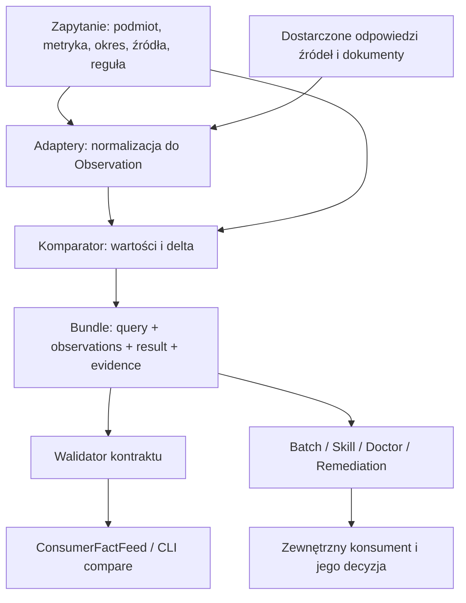

# Audyt data2dsl: jak rozumiem kod i czy projekt jest ukończony

Data: **28 sierpnia 2026**. Autor: Codex. Ticket: **058**.
Badany commit: **`1e7eddd75a40b6c4388869a8210d2c42ca9d9e5e`**.
Zakres zmian w tym zadaniu: raport i dokumentacja ticketu; **bez naprawiania kodu aplikacji**.

## 1. Werdykt

**Nie uważam tego repozytorium za ukończone w 100%.** Jest tu działająca implementacja podstawowego porównywania, sensowny podział odpowiedzialności i sporo testów. Jednocześnie istnieją odtworzone błędy, które uniemożliwiają uznanie całości za gotowy, spójny produkt.

Najważniejsze dowody:

- Wheel buduje się, ale nie zawiera modułów aplikacji ani schematu JSON. Import CLI z samego artefaktu kończy się `ModuleNotFoundError`.
- Generator „kanonicznych” zapytań produkuje dane odrzucane przez własny kontrakt.
- Interfejs agentowy i batch mogą zwrócić `MATCH` dla obserwacji dotyczących innego aktora albo innego zapytania.
- Parser Markdown potrafi przypisać Alice liczbę commitów Boba.
- Adapter OQL potrafi zamienić różne pomiary na dwa zera i zwrócić fałszywy `MATCH`.
- Transport MCP, eksport remediation oraz przykłady mają niespójności z deklarowanymi kontraktami.

**84/84 testy przeszły. To jest prawdziwe, ale nie oznacza kompletności produktu.** Dodatkowe próby wykazały błędy poza zakresem tych testów. Pokrycie instrukcji zmierzone podczas pełnego przebiegu wyniosło około **86%**, nie 100%; również 100% pokrycia nie byłoby dowodem poprawności semantycznej.

Nie widziałem analizy Gemini, więc nie oceniam sposobu jej powstania. Jeżeli „100%” oznaczało wyłącznie odhaczone zadania albo przechodzące istniejące testy, to jest to znacznie węższe stwierdzenie niż „repozytorium jest gotowe”. Nie podaję arbitralnego procentu ukończenia: brak uzgodnionej, zamkniętej definicji produktu, a usterki mają bardzo różną wagę.

## 2. Co zbadałem i czego ten audyt nie dowodzi

Przejrzałem wszystkie moduły aplikacji w `src/`, schemat porównania, walidator i manifest DSL, strukturę i istotne asercje całego zestawu testów, przykłady, konfigurację pakowania, Docker, workflow CI oraz dokumenty opisujące architekturę. Uruchomiłem testy, kontrole jakości, kontrolę governance, budowę wheel i dodatkowe próby w pamięci.

Inwentarz badanego commitu: **12 plików Python w `src/`**, 17 plików łącznie w tym katalogu, 13 plików w `tests/`, 13 dokumentów w `docs/`. Warstwa governance to osobny, zarządzany pakiet: 29 plików w `.governance/`, około 8,6 tys. linii. Sprawdziłem jego rolę, konfigurację i wynik bramki; nie traktuję tego raportu jako pełnego audytu bezpieczeństwa każdego wiersza tego upstreamowego pakietu ani wszystkich historycznych logów ticketów.

Nie sprawdzałem działania z rzeczywistym kontem GitHub, uruchomionym `koru`, `todo2code`, Diagit, przeglądarką Curllm ani sprzętem OQL. Nie badałem prywatnych ustawień GitHub, aktualnych rulesetów, zewnętrznych reviewerów ani opublikowanych paczek. Nie uruchamiałem napraw ani operacji na produkcji. Wyniki dotyczą wskazanego commitu i lokalnie dostępnego kodu.

## 3. Jak rozumiem projekt

### 3.1. Rola produktu

`data2dsl` ma być **warstwą sprawdzania faktów pomiędzy źródłami danych a systemem podejmującym decyzje**.

Przykład: dokument deklaruje 12 commitów Alice w konkretnym repozytorium i tygodniu, a dostarczona odpowiedź źródła GitHub podaje 10. Program powinien sprawdzić, czy oba pomiary dotyczą tego samego pytania, i zwrócić `CONFLICT`, deltę `-2` oraz dowody. Sam nie powinien decydować, czy poprawić dokument, czy kod, ani wykonywać naprawy systemu.

Diagram pokazuje istotną cechę **obecnego kodu**: walidacja nie jest wspólną, obowiązkową bramką wszystkich ścieżek. CLI `compare` i feed konsumenta walidują bundle, ale część pozostałych wejść omija tę kontrolę.

### 3.2. Model danych

| Element | Znaczenie |
| --- | --- |
| `query` | Określa repozytorium, aktora, metrykę, typ wartości, jednostkę, przedział czasu, dwa źródła i politykę porównania. |
| `observation` | Pomiar po lewej lub prawej stronie, jego stan, wartość i lista dowodów. |
| `evidence` | URI źródła, rewizja, deklarowany SHA-256, lokalizacja i identyfikator ekstraktora. |
| `result` | Wynik porównania, identyfikatory obserwacji i dowodów oraz delta. |
| `comparison-bundle/v0` | Wspólna paczka zawierająca powyższe elementy i powiązania z profilami DSL. |

Komparator obsługuje `integer`, `float`, `percentage`, `string`, `string-set`. Delta liczbowa ma kierunek **prawa minus lewa**. Dla zbiorów zwracane są `added` i `removed`. Wyniki to `MATCH`, `CONFLICT`, `MISSING_LEFT`, `MISSING_RIGHT`, `UNEVALUABLE`. Kontrakt dopuszcza także stan obserwacji `EXPIRED`, ale nie ma tu automatycznego mechanizmu wyznaczania terminu ważności pomiaru.

### 3.3. Mapa kodu

| Plik | Rzeczywista odpowiedzialność |
| --- | --- |
| [data2dsl_adapters.py](../src/data2dsl_adapters.py) | Dziesięć adapterów i klasy odpowiedzi źródłowych; normalizacja wartości i budowa referencji dowodowych. Największy moduł, około 1,7 tys. linii. |
| [data2dsl_comparator.py](../src/data2dsl_comparator.py) | Porównywanie wartości i składanie bundle. Sam nie weryfikuje zgodności podmiotu, okna ani dowodów z zapytaniem. |
| [comparison.schema.json](../src/data2dsl_contract_v0/comparison.schema.json) oraz [validate.py](../src/data2dsl_contract_v0/validate.py) | Strukturalna i semantyczna walidacja bundle, m.in. wspólne klucze, unikalność identyfikatorów, wynik i delta. |
| [data2dsl_cli.py](../src/data2dsl_cli.py) oraz [__main__.py](../src/__main__.py) | Obsługa plików, poleceń porównywania, walidacji, eksportów, batch, generatora i symulacji. |
| [data2dsl_batch.py](../src/data2dsl_batch.py) | Dobieranie obserwacji do wielu zapytań, agregacja wyniku, digest raportu i format Markdown. |
| [data2dsl_generator.py](../src/data2dsl_generator.py) | Generator szablonu JSON z domyślnymi polami; nie jest parserem języka naturalnego. |
| [data2dsl_consumer.py](../src/data2dsl_consumer.py) | Eksport zwalidowanego bundle do lokalnego formatu faktów dla konsumenta; oblicza digest całej paczki. |
| [data2dsl_doctor.py](../src/data2dsl_doctor.py) | Formatowanie symptomów i priorytetów według wbudowanych progów; tworzenie podsumowania. |
| [data2dsl_remediation.py](../src/data2dsl_remediation.py) | Zamiana wyników na propozycje działań i statusy; nie wykonuje napraw. |
| [data2dsl_skill.py](../src/data2dsl_skill.py) | API dla agentów, konwersja wejść raw, routing URI i ręczna obsługa komunikatów MCP. |
| [data2dsl_subactor.py](../src/data2dsl_subactor.py) | Parsowanie koperty delegacji, proste reguły pól i demonstracyjna symulacja naprawy. |
| [connector.manifest.json](../src/connector.manifest.json) | Deklaracja instalacji i możliwości konektora; sama deklaracja nie dowodzi działającej integracji. |

Pozostała warstwa to governance: alokacja ticketów, własność ścieżek, kontrola intencji i budżetów, zewnętrzne dowody zatwierdzenia, lifecycle gałęzi/worktree oraz walidacja remediation. `scripts/runtime.sh` służy ocenie zmian i dowodów, a nie porównywaniu danych aplikacji. Jedyny workflow w badanym repo sprawdza lifecycle gałęzi GitHub.

### 3.4. Co oznacza „10 adapterów”

| Adapter | Co rzeczywiście robi lokalny kod |
| --- | --- |
| GitHub/Diagit | Przyjmuje przekazaną liczbę commitów i opcjonalne dane dowodowe stron. Nie odpytuje API GitHub. |
| Markdown | Wyszukuje liczbę commitów przez regex i dzielenie wierszy tabeli. Nie wywołuje `mdflow`, choć tak nazywa ekstraktor. |
| Code2Logic | Przepisuje przekazaną wartość metryki. Nie uruchamia analizy CFG/DFG. |
| Code2Schema | Liczy lub sortuje przekazane nazwy encji. Nie uruchamia parsera schematu. |
| Curllm | Normalizuje dostarczoną wartość i strony dowodowe. Nie steruje przeglądarką. |
| Planfile | Liczy zadania lub zbiera ich identyfikatory z obiektów odpowiedzi. Nie wczytuje sam pliku Planfile. |
| Deta | Normalizuje przekazane usługi/porty. Nie wywołuje `build_topology()`. |
| IntentContract | Przetwarza listy stron, zobowiązań lub rezultatów z odpowiedzi. |
| OQL | Normalizuje przekazaną specyfikację/pomiar. Nie czyta strumienia urządzenia ani nie wylicza agregatów z logu. |
| SUMD | Lokalnie parsuje proste wiersze tabel i `klucz: wartość`, potem normalizuje wynik. |

Taka cienka granica adapterów jest sensowna. Nie trzeba zamieniać projektu w dziesięć klientów API. Trzeba jednak opisać, kto dostarcza dane, i udowodnić zgodność z rzeczywistymi odpowiedziami dostawców. Nazwa zewnętrznego projektu w polu `extractor` nie dowodzi, że został on użyty.

## 4. Co jest już wartościowe i działa

- Podstawowy golden case dla poprawnych danych integer działa i przechodzi walidację.
- Jest jawny model danych, wersjonowane nazwy schematów i rozdzielenie porównania od późniejszych działań.
- Walidator wykrywa m.in. błędnego aktora, niepoprawną deltę, brak dowodów i nieuporządkowane zbiory.
- Istnieją API Python, CLI i eksport faktów z digestem paczki.
- Repo posiada 84 przechodzące testy; ruff przechodzi. To realna baza do dalszej pracy.
- Governance ma zarządzane skrypty, intencje, ograniczenia ścieżek i mechanizmy zatwierdzania. Docker ma przypięty digest obrazu bazowego.

Nie proponuję przepisywania projektu od zera. Największy problem to niespójność między modułami i deklaracjami, a nie brak całej implementacji.

## 5. Potwierdzone problemy i prace do wykonania

Priorytet **P1** oznacza blokadę wiarygodnego wydania deklarowanych funkcji; **P2** oznacza istotną poprawkę jakości lub doprecyzowanie zakresu. To priorytety tego audytu, nie automatycznie utworzone tickety naprawcze.

### F01 — P1: artefakt dystrybucyjny nie zawiera aplikacji

**Dowód:** [pyproject.toml](../pyproject.toml), linie 31–35. Zbudowałem wheel z kopii `src/`, README i konfiguracji w katalogu tymczasowym, bez zmiany repo i bez pobierania zależności.

Wheel zawierał wyłącznie `data2dsl_contract_v0/validate.py` i metadane `dist-info`. Brakowało m.in. `data2dsl_cli.py`, adapterów, komparatora, `comparison.schema.json` i fixtures self-testu. Import `data2dsl_cli` z wheel w izolowanym procesie zakończył się `ModuleNotFoundError`.

**Do zrobienia:** poprawić odkrywanie modułów/pakietów i dołączanie zasobów. Dodać test instalacji wheel w pustym środowisku: `data2dsl --help`, `--self-test`, porównanie i walidacja. Testy z `PYTHONPATH=src` nie zastępują tego sprawdzenia.

### F02 — P1: kontrakt nie obejmuje deklarowanych adapterów, generator produkuje niezgodne zapytania

**Dowód:** [comparison.schema.json](../src/data2dsl_contract_v0/comparison.schema.json), linie 53, 70–76, 84 i definicja `location`; [data2dsl_generator.py](../src/data2dsl_generator.py), linie 39–76.

- Schemat dopuszcza tylko źródła `markdown` i `github`, a lokalizacje tylko `markdown-lines` i `github-page`.
- Nowsze adaptery emitują m.in. `yaml-lines`, `json-lines`, `oql-scenario`, `oql-telemetry-log`, `sumd-document`.
- Generator emituje wersję metryki `1.0.0`, podczas gdy kontrakt wymaga `v1`, `v2` itd.
- Domyślne `exact` oraz `set-exact` nie są dopuszczonymi politykami kontraktu.
- W generatorze okres czasu jest na stałe ustawiony na 1–27 sierpnia 2026.

Próba `generate_query_template('markdown', 'git.commit.count')` wykazała dwa błędy schematu już w samym zapytaniu. Dla innych źródeł dochodzą kolejne niezgodności.

**Do zrobienia:** uzgodnić jeden kontrakt dla rzeczywiście wspieranych źródeł i wyprowadzić z niego generator, adaptery oraz fixtures. Test akceptacyjny: wynik każdego wspieranego wariantu generatora przechodzi właściwy walidator. Szablon musi jawnie wymagać lub przyjmować okres porównania.

### F03 — P1: fałszywy MATCH dla innego podmiotu lub zapytania

**Dowód:** [data2dsl_comparator.py](../src/data2dsl_comparator.py), linie 31–85; [data2dsl_skill.py](../src/data2dsl_skill.py), metoda `execute_compare`; [data2dsl_batch.py](../src/data2dsl_batch.py), linie 90–124.

Komparator patrzy na stan i wartości. Nie sprawdza zgodności `subject`, `metric`, `window`, `query_id`, stron ani polityki typów. Skill nie waliduje zwróconego bundle. Batch dodatkowo dopasowuje obserwacje po samym `metric.id`, nadpisując duplikaty.

**Odtworzenie:** w poprawnym fixture MATCH zmieniłem wyłącznie aktora prawej obserwacji. Skill zwrócił `status: OK` i `MATCH`; walidator tego samego bundle poprawnie zgłosił `observation right subject must match query`. Po zmianie `query_id` prawej obserwacji batch nadal zwrócił `is_clean: true`.

**Do zrobienia:** wspólna obowiązkowa kontrola porównywalności dla wszystkich publicznych wejść. Dobór po pełnym kluczu, odrzucanie niejednoznacznych duplikatów i testy różnych aktorów, repozytoriów, okresów, typów oraz stron. CLI `compare` już ma późniejszą walidację — problem nie dotyczy każdej ścieżki identycznie.

### F04 — P1: parser Markdown przypisuje cudzą deklarację do pytanego aktora

**Dowód:** [data2dsl_adapters.py](../src/data2dsl_adapters.py), `extract_commit_claim`, szczególnie linia 235. Warunek dopuszcza wiersz, jeśli występuje w nim aktor **lub** słowo `commit`.

Wejście `Bob: 99 commits\nAlice: 12 commits`, pytanie o `alice`: uzyskano **99 z pierwszego wiersza**. Normalizacja następnie opisuje tę wartość aktorem z query, więc późniejsza kontrola zgodności pól już nie odkryje pomyłki źródłowej.

**Do zrobienia:** jednoznaczne dopasowanie aktora, metryki i kontekstu okresu; błąd/niejednoznaczność przy wielu pasujących deklaracjach. Testy z wieloma aktorami i tabelami z kilkoma kolumnami liczbowymi. Analogicznie SUMD nie powinien wybierać `tasks_completed_total`, gdy pytanie dotyczy dokładnie `tasks_completed`, tylko dlatego że klucz jest podciągiem.

### F05 — P1: błędne mapowanie metryk i zamiana braku pomiaru na zero

**Dowód:** [data2dsl_adapters.py](../src/data2dsl_adapters.py), linie 940, 1097, 1269 i 1408. Deta, IntentContract oraz OQL wybierają pole przez `metric.name`/`metric.property`; kontrakt używa `metric.id` i zabrania dodatkowych pól metryki.

**Odtworzenie:** dla kanonicznego `metric.id = oql.sample_rate` podałem specyfikację **100** i telemetrię **42**. Obie obserwacje dostały `0.0`; wynik był `MATCH`. Osobno brak `avg_sample_rate_hz`, przy rozpoznanej nazwie metryki, dał `state: OBSERVED`, `value: 0.0`.

OQL ignoruje także pola `timestamp_start`/`timestamp_end` odpowiedzi i przepisuje okno z query. Zaokrąglanie do dwóch miejsc podczas normalizacji może ukrywać różnice. W `_normalize_raw` użycie `a or b` do wyboru pomiaru traktuje prawidłowe zero jak brak pierwszej wartości.

**Do zrobienia:** jawna mapa `metric.id → pole odpowiedzi`, odróżnienie brak/zero, kontrola okresu i jednostek oraz świadoma polityka precyzji. Nieznana metryka ma powodować błąd lub `UNEVALUABLE`, nigdy zastępczy pomiar zero.

### F06 — P1: obecność SHA-256 nie dowodzi integralności źródłowego pomiaru

**Dowód:** [data2dsl_adapters.py](../src/data2dsl_adapters.py), linie 140, 984, 1120, 1325 i 1463.

GitHub przy braku stron tworzy `dummy_digest` z repozytorium, liczby i okresu, a nie z odpowiedzi API. CLI golden i raw routing nie zachowują pełnych stron dowodowych. Deta w wariancie bez usług hashuje samą ścieżkę manifestu. OQL dla zbioru pinów hashuje identyfikator, ścieżkę i `value`, choć zbiór jest zapisany w `items`.

**Odtworzenie:** zmiana pinów z `['PA1']` na `['PB2']` przy tej samej ścieżce i identyfikatorze dała **ten sam digest dowodu**. To błąd zakresu haszowanych danych, nie kolizja algorytmu SHA-256.

Walidator sprawdza format digestu, ale nie pobiera ani nie weryfikuje treści pod URI. Dodatkowo digest schematu i walidatora zapisany w [dsl-manifest.json](../src/data2dsl_contract_v0/dsl-manifest.json) nie odpowiada bajtom obu plików z badanego commitu. Zweryfikowałem to przez `git show HEAD:...`, więc nie jest to problem końców linii Windows. Digests obu fixtures z manifestu są poprawne.

**Do zrobienia:** zdefiniować dokładnie haszowany obiekt, zachowywać surowe dowody lub ich weryfikowalne odnośniki i rozdzielić digest danych pochodnych od źródłowych. Identyfikatory powinny uwzględniać kontekst pytania i strony. Dodać test: każda istotna zmiana źródła zmienia digest. Uzgodnić aktualizację manifestu DSL i kontrolę jego hashy w CI.

### F07 — P1: raw JSON nie działa dla części adapterów mimo przechodzących testów obiektów Python

**Dowód:** [data2dsl_skill.py](../src/data2dsl_skill.py), `_normalize_raw`, linie 41–180; [test_skill.py](../tests/test_skill.py), testy Curllm i Code2Schema.

Odtworzone przypadki:

| Wejście | Wynik |
| --- | --- |
| Code2Schema: zwykły słownik z `entities` | `TypeError`: konstruktor `Code2SchemaMetricResponse` nie przyjmuje przekazywanego `value`. |
| Planfile: lista słowników ticketów | `AttributeError`: słownik nie ma atrybutu `digest_sha256`. |
| Curllm: wartość i lista stron w JSON | Strony są pomijane przy konwersji; obserwacja staje się `UNEVALUABLE`. |

Testy części tych ścieżek podają gotowe instancje dataclass przez `raw['response']`. Takie obiekty nie przychodzą przez transport JSON/MCP.

**Do zrobienia:** jawna deserializacja wszystkich odpowiedzi i zagnieżdżonych dowodów. Testy każdego adaptera przez serializację JSON i publiczny interfejs, nie tylko bezpośrednie wywołania z obiektami Python.

### F08 — P1: MCP wymaga poprawy protokołu i sposobu uruchamiania

**Dowód:** [data2dsl_skill.py](../src/data2dsl_skill.py), linie 194, 290, 420 i 495; [pyproject.toml](../pyproject.toml).

- `tools/list` zwraca definicje z `parameters`, a protokół deklarowanej wersji wymaga `inputSchema`. [Specyfikacja MCP 2024-11-05: Tools](https://modelcontextprotocol.io/specification/2024-11-05/server/tools).
- Wywołanie self-testu w pętli STDIO wypisuje przed JSON-em tekst `CONTRACT-V0-PASS: ...`. Odtworzyłem to przez rzeczywiste `main_mcp()` z wejściem/wyjściem w pamięci. STDOUT może zawierać wyłącznie komunikaty MCP. [Specyfikacja MCP 2024-11-05: Transports](https://modelcontextprotocol.io/specification/2024-11-05/basic/transports).
- Jest funkcja `main_mcp`, ale nie ma dla niej entrypointu w pakiecie ani wywołania przy uruchomieniu modułu.
- Błędy wykonania są chowane w tekście wyniku bez odpowiedniego `isError`; ogólny wyjątek w pętli dostaje kod błędu parsowania nawet dla innych problemów.

**Do zrobienia:** poprawne schematy narzędzi, czysty STDOUT, dostępny entrypoint, poprawne błędy i test sesji `initialize → tools/list → tools/call` przez subprocess/klienta MCP. Sam test funkcji `handle_mcp_message` jest niewystarczający.

### F09 — P1: feed remediation używa nazwy istniejącego schematu, ale ma inny format

**Dowód:** [data2dsl_remediation.py](../src/data2dsl_remediation.py), linie 41 i 208; [.governance/remediation-intent.schema.json](../.governance/remediation-intent.schema.json).

Eksport deklaruje `new-project.remediation-intent/v1`, ale emituje `actionable_items`, `evidence_digest` i statusy `PROPOSED/SATISFIED/BLOCKED`. Lokalny schemat o tej samej nazwie wymaga m.in. `intentId`, `repository`, `scope`, `findings`, `actions`, `verifications`, `acceptanceCriteria`, `llmGuidance`, `todo2code` i statusów `DRAFT/READY/ANALYZED`.

Walidacja rzeczywistego wyniku eksportu wykazała **15 błędów strukturalnych**. To lokalnie potwierdzona kolizja kontraktów; nie twierdzę, że uruchomiłem i sprawdziłem wszystkie wersje zewnętrznego Koru.

**Do zrobienia:** albo wygenerować właściwy, ograniczony intencją dokument, albo użyć osobnego schematu feedu i jawnego konwertera. Wynik formatowania nie może automatycznie stać się uprawnieniem do naprawy. Doctor i Remediation powinny także kontrolować wejściowy bundle; obecnie mogą zaufać wpisanemu ręcznie `MATCH`.

### F10 — P2: batch gubi znaczenie brakujących obserwacji

**Dowód:** [data2dsl_batch.py](../src/data2dsl_batch.py), linie 126–155.

Zamiast przekazać `None`, batch tworzy fikcyjną obserwację `state: MISSING`, `value: null`, `evidence: []`. Komparator interpretuje taki obiekt jako `UNEVALUABLE`, więc liczniki `missing_left`/`missing_right` pozostają zerowe. Sam obiekt nie spełnia kontraktu, który nie dopuszcza stanu `MISSING` ani pustej listy dowodów.

**Do zrobienia:** uzgodnić reprezentację braku i obsługę przypadku obu brakujących stron. Oczekiwane kryterium: brak lewej strony daje `MISSING_LEFT`, licznik 1 i wynik zgodny z kontraktem, a nie tylko dowolny wynik „nieczysty”.

### F11 — P2: komparator i walidator inaczej rozumieją float-exact

**Dowód:** [data2dsl_comparator.py](../src/data2dsl_comparator.py), linie 117–136; [validate.py](../src/data2dsl_contract_v0/validate.py), porównanie wartości w liniach 187–195.

Komparator używa tolerancji `1e-9` dla float i `1e-6` dla percentage, a walidator zwykłej równości. Dla `1.0000000000` oraz `1.0000000005` komparator zwrócił `MATCH`, a walidator: `outcome must be CONFLICT`. Zaokrąglenie delty może też prowadzić do konfliktu z deltą zero.

**Do zrobienia:** jedna semantyka współdzielona przez komparator i walidator; albo rzeczywiste exact, albo jawna tolerancja zapisana w kontrakcie. Dodać graniczne testy precyzji, zakresu i wartości niefinitywnych.

### F12 — P2: formatter Markdown psuje raport braków i zbiorów

**Dowód:** [data2dsl_batch.py](../src/data2dsl_batch.py), linie 251–253 i 277–279.

Odtworzone: `format_markdown_report` dla batch z brakującą stroną zgłasza `AttributeError: 'NoneType' object has no attribute 'get'`. Dla `string-set` raport pokazuje `None` zamiast elementów i różnic. Nie ma także bezpiecznego formatowania znaków `|`, nowych linii i backticków w tabelach.

**Do zrobienia:** osobny formatter wartości i delty, jawna obsługa null, zbiorów, pustych zbiorów i tekstu. Testy wszystkich pięciu wyników oraz wszystkich typów wartości.

### F13 — P2: koperta i symulacja nie dowodzą pełnej zgodności ani rzeczywistej naprawy

**Dowód:** [data2dsl_subactor.py](../src/data2dsl_subactor.py), linie 145–147 i 173–240; [ADR-007](decisions/ADR-007-subactor-conformance-and-closed-loop-self-healing.md).

Walidacja authority sprawdza podciągi: `authority: planet` przechodzi, ponieważ zawiera `plan`. Pola zakresu i limitów pozostają tekstem; to nie jest mechanizm egzekwowania uprawnień.

`simulate_self_healing_cycle` kopiuje wartość lewej obserwacji do prawej, dopisuje `:repaired`/`#repaired` i ponownie porównuje. Nie naprawia systemu, nie odczytuje świeżej telemetrii i nie przelicza źródłowego digestu. W podsumowaniu odczytuje też nieistniejący klucz `severitySummary` zamiast `summary`.

**Do zrobienia:** zostawić tę funkcję jako jasno oznaczoną symulację, poprawić walidację tokenów i opis gwarancji. Prawdziwy wykonawca napraw może pozostać poza repo — zgodnie z jego założeniami — ale określenie „naprawa zweryfikowana” wymaga nowych, niezależnie pozyskanych obserwacji.

### F14 — P2: przykłady i deklaracje gotowości rozmijają się z kodem

Potwierdziłem następujące rozbieżności:

- Przykład 02 nie uruchamia się w pokazanej postaci: konstruktor wymaga brakujących `scenario_id` i `path`.
- Rzeczywisty request przykładu 05 zwraca `ERROR` z komunikatem `'window'`, zamiast deklarowanego MATCH.
- Komenda przykładu 07 kończy się kodem 2: `--left-type sumd` nie istnieje w parserze CLI.
- Przykład 08 zwraca kod 0 i dwa MATCH, ale oba bundle są odrzucane przez walidator, m.in. z powodu brakującego `target_uri`.
- `expected-bundle.json` przykładów 01 i 02 nie spełniają kontraktu porównania, m.in. zawierają niedopuszczone `bundle_id` i inną nazwę schematu.
- README jednocześnie twierdzi, że brak implementacji, i deklaruje ukończone fazy. Wymienia narzędzie `data2dsl_feed_doctor`, którego nie ma na liście narzędzi ani w dispatchu.
- Tickety 051–057 mają `PLAN / PUBLICATION`, choć README opisuje ukończenie faz. To pozostałość procesu do wyjaśnienia i zamknięcia na podstawie integracji, nie dowód braku całej implementacji.

**Do zrobienia:** uruchamialne przykłady bez niezdefiniowanych zmiennych, walidacja oczekiwanych artefaktów, testy instrukcji CLI, rozdzielenie funkcji wdrożonych od propozycji ADR/research i korekta listy narzędzi.

### F15 — P2: odtwarzalność kontroli jakości i wydania nie jest domknięta

**Dowód:** [pyproject.toml](../pyproject.toml), [workflow](../.github/workflows/new-project-governance.yml), [.governance/manifest.json](../.governance/manifest.json), [Dockerfile](../Dockerfile).

`pyproject.toml` deklaruje `jsonschema>=4.26.0`, ale walidator żąda dokładnie `4.26.0`. Zależność uznana przez instalator za poprawną może więc zostać odrzucona w runtime. Extra `test` nie opisuje kompletnego środowiska kontroli jakości. Brakuje zapisanej konfiguracji mypy odpowiadającej używanemu sposobowi analizy.

Jedyny lokalny workflow sprawdza zdalny lifecycle gałęzi. Nie definiuje przebiegu pytest, budowania i instalowania wheel, zgodności przykładów czy sesji MCP. Ewentualnych zewnętrznych kontroli nie zweryfikowałem. `GOV-PASS` nie jest wynikiem testów aplikacji; manifest ma `stacks: []`.

**Do zrobienia:** spójna polityka zależności i powtarzalny zestaw komend, CI testujące artefakt oraz wspierane wersje Pythona, kontrola przykładów i hashy. Osobno dopiąć skan zależności i bezpieczeństwa oraz rzeczywiste wykonanie testów Docker. Nie zmieniać zarządzanych plików governance ad hoc — użyć właściwego procesu adopcji/konfiguracji.

## 6. Wyniki uruchomionych kontroli

Środowisko: Windows, Python **3.14**; pytest **9.1.1**, jsonschema **4.26.0**, ruff **0.15.21**, mypy **2.3.0**, setuptools **83.0.0**, build **1.5.1**, coverage **7.15.1**. To nie zastępuje macierzy wersji 3.10–3.12 wymienionych w metadanych projektu.

| Kontrola | Wynik i interpretacja |
| --- | --- |
| `python -m pytest -q -p no:cacheprovider` | **84 passed**. |
| Powtórny pełny przebieg pod `coverage.Coverage(data_file=None, source=['src'])` | **84 passed**, 1884 instrukcje, 268 niepokrytych, około **86%**. To pokrycie instrukcji, nie gałęzi. |
| `python -m ruff check src tests --output-format concise` | **PASS**. |
| `python -m mypy src` | **FAIL**: brak stubów jsonschema i podwójne wykrycie modułu `validate`. Ograniczenie konfiguracji/środowiska, nie samo w sobie dowód błędu runtime. |
| `python -m mypy --explicit-package-bases --ignore-missing-imports src` | **PASS**, 12 plików; wariant z ignorowaniem brakujących importów jest słabszą kontrolą. |
| `python src/data2dsl_contract_v0/validate.py --self-test` | **PASS**: 5 pozytywnych wyników i 5 negatywnych niezmienników. |
| `project\governance-check.bat` | **GOV-PASS**, 0 błędów, 0 ostrzeżeń. |
| `python -m build --wheel --no-isolation` w tymczasowej kopii | Build **PASS**, kontrola kompletności/importu **FAIL** — F01. |
| `docker compose config --quiet` | **PASS** składni konfiguracji. |
| `docker version` | Brak działającego `dockerDesktopLinuxEngine`; build/run kontenera **niezweryfikowane**. |
| Dodatkowe próby w pamięci i subprocess CLI | Odtworzone przypadki F02–F14 opisane powyżej. |
| Hashy manifestu DSL z bajtów `git show HEAD:...` | **2 z 4 niezgodne**: schema i validate.py. |
| Bandit, pip-audit, skan obrazu/SBOM | **Nie wykonano**; brak lokalnych modułów bandit/pip-audit i działającego silnika Docker. |

Pierwsza próba pomiaru coverage napotkała 11 błędów dostępu do katalogu tymczasowego pytest w sandboxie. Po ponowieniu z wymaganym zezwoleniem wszystkie 84 testy przeszły. Nie zaliczam tych błędów uprawnień do usterek repozytorium. Analogicznie budowę wheel wykonano po zezwoleniu na zapis plików tymczasowych.

### Dlaczego istniejące testy tego nie wykryły?

Nowe moduły często są sprawdzane na uproszczonych słownikach, bez `validate_document`. Niektóre fixtures mają skrócone hashe, `version: 1.0.0`, niewspierane źródła albo niepełne evidence. Test generatora wręcz oczekuje `exact` i `set-exact`, mimo że kontrakt ich zabrania. Testy raw adapterów częściowo korzystają z obiektów dataclass, omijając serializację. Nie ma testu instalacji wheel ani pełnej sesji STDIO MCP. Zielony wynik oznacza więc zgodność z obecnymi asercjami, nie z całym kontraktem produktu.

## 7. Co robić dalej — proponowana kolejność

### Etap A: wiarygodność porównania

- [ ] Uzgodnić źródła, lokalizacje evidence, wersje metryk i polityki w jednym kontrakcie — F02.
- [ ] Wymusić walidację wszystkich publicznych wejść/wyjść oraz pełnego klucza porównania — F03.
- [ ] Naprawić wybór aktora w Markdown, mapowanie metryk i reprezentację braków — F04, F05, F10.
- [ ] Ujednolicić semantykę liczb i tolerancji — F11.
- [ ] Powiązać dowody z rzeczywistą treścią i usunąć niespójne hashe — F06.

**Warunek zakończenia:** dla danych nieporównywalnych, nieznanej metryki lub brakującego pomiaru żadna publiczna ścieżka nie zwraca „czysto”. Każdy wygenerowany bundle przechodzi wspólną walidację lub jest jawnie odrzucony.

### Etap B: działające wydanie i integracje

- [ ] Poprawić wheel i test instalacji w izolacji — F01.
- [ ] Przetestować wszystkie adaptery na zwykłym JSON oraz prawdziwych, zanonimizowanych odpowiedziach dostawców — F07.
- [ ] Naprawić i przetestować sesję MCP oraz opisać uruchamianie — F08.
- [ ] Uzgodnić feed remediation z odbiorcą i jego walidatorem — F09.
- [ ] Dodać choć jeden test całego przepływu: źródło/fixture dostawcy → adapter → komparator → walidator → konsument.

**Warunek zakończenia:** użytkownik po instalacji artefaktu wykonuje udokumentowany scenariusz bez importowania kodu z checkoutu i bez ręcznych poprawek danych pośrednich.

### Etap C: domknięcie jakości i deklaracji

- [ ] Poprawić formatter raportów — F12.
- [ ] Wyraźnie oddzielić symulację, format koperty i rzeczywiste wykonanie/authority — F13.
- [ ] Naprawić przykłady i README; wykonać odpowiednie closures ticketów — F14.
- [ ] Uruchamiać testy, instalację wheel, przykłady, kontrakty i MCP w CI; ustalić zależności — F15.
- [ ] Po uruchomieniu Docker wykonać faktyczne testy kontenera; przed publikacją wykonać wymagane kontrole zewnętrzne i lifecycle.

**Warunek zakończenia:** każda deklaracja „działa”, „zgodne” i „gotowe” ma odpowiadający jej odtwarzalny test lub jawnie ograniczony zakres.

## 8. Czego nie trzeba dopisywać tylko po to, żeby nazwać projekt skończonym

Nie widzę konieczności dodawania GUI, kolejnych adapterów, bazy danych, własnego LLM ani przenoszenia wykonawcy napraw z Koru do tego repo. Integracja NLP może pozostać zewnętrznym, opcjonalnym etapem; w tym repo są decyzja i notatki, a nie gotowy kompilator języka naturalnego. Pobieranie danych może nadal należeć do źródeł.

Najpierw doprowadziłbym do spójności obecny zakres. **Obecna ocena: działający rdzeń/prototyp integracyjny, wymagający istotnych poprawek przed wiarygodnym wydaniem wszystkich deklarowanych możliwości.** O „100%” można rozmawiać dopiero względem zaakceptowanej listy kryteriów, po usunięciu potwierdzonych błędów i sprawdzeniu publicznych ścieżek użytkownika.
