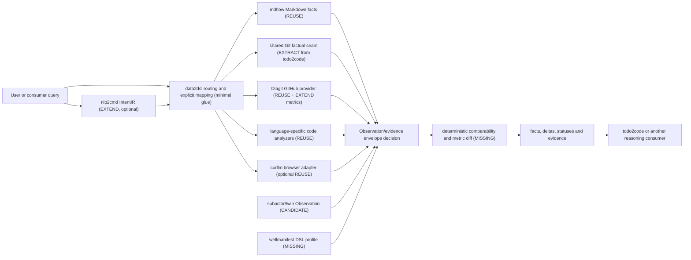

# Phase 0 capability map

Date: 2026-08-13
Scope: discovery and governance only; no product implementation or final DSL.

## Decision rules

The inventory uses current repository contents as evidence and prefers, in
order: `REUSE`, `EXTRACT`, `EXTEND`, then `MISSING`. `CANDIDATE` means that a
component is relevant but its stability or fit is not yet sufficient for an
integration decision. `REJECTED` means that the inspected component does not
provide the claimed generic capability; it is not a judgment on that product's
own domain.

The scan covered the current top-level repositories under `semcod/*` (78 Git
repositories), `subactor/*` (60), and `wellmanifest/*` (15). Repository
metadata and READMEs were used for broad candidate discovery. A candidate was
classified only after checking its current package/CLI surface, implementation
and tests. Paths below are organization-relative and revisions make the
evidence reproducible. README-only or roadmap-only claims are not treated as
implemented capability.

## Capability inventory

| Capability | Repo | File / CLI / API | Input | Output | Coupling | Evidence | Status | Integration |
| --- | --- | --- | --- | --- | --- | --- | --- | --- |
| Immutable project governance | `wellmanifest/new-project` | public Goal `governance adopt`; adopted `.governance/manifest.json` and lock | published tag and immutable revision | governed repository carrier and deterministic gate | governance-only; no product runtime | published `v0.16.2`, peeled revision `63a03d0c2ec417f8eab9a6edb3c4ed654937a1ac`; local adoption lock | **REUSE** | Keep as development governance; never import into product runtime. |
| Markdown structural acquisition | `semcod/mdflow` | Python `MdFlow.parse`, `parse_text`, `parse_dir`, `scan`; CLI `mdflow` | Markdown text, file, or directory | structured document facts: headings, links, fences, tables and list items | Python >=3.11; package also declares development/tooling dependencies, but parser implementation is separable | `mdflow/__init__.py`, `mdflow/parser.py`, `tests/`; revision `f87c89ddfca7f95a29ccbb19c8d47bbb0ada6b32` | **REUSE** | Use the public parser/scan API through a thin source adapter; keep metric meaning in data2dsl mapping. |
| TODO/CHANGELOG intent extraction | `semcod/todo2code` | TS `extractMarkdownIntent` | TODO and CHANGELOG Markdown files plus `T2CConfig` | `IntentRecord[]` | deliberately limited to TODO/CHANGELOG; tied to todo2code config and Intent DSL | `src/extractors/markdown.ts`, `test/markdown.test.ts`, exports in `src/index.ts`; revision `fb05e99e50c5fd20f911423c0ffd2416a7688378` | **REUSE** | Consume only when the requested result is todo2code Intent; do not advertise as generic Markdown parsing. |
| Git factual acquisition | `semcod/todo2code` | private `runGit`, `readCommits`, `readChangedFiles`, `readStats` inside `extractGitIntent` | local Git repository and revision range | commit, changed-file, numstat and diff facts before intent mapping | private helpers are fused to `T2CConfig`, text inference and `IntentRecord` construction; npm package is `private` | `src/extractors/git.ts`, `test/git.test.ts`, `package.json`; revision `fb05e99e50c5fd20f911423c0ffd2416a7688378` | **EXTRACT** | In a later ticket, move the smallest factual Git seam to a shared TS package without semantic changes; todo2code keeps intent mapping. No TypeScript-to-Python rewrite. |
| Git-to-intent mapping | `semcod/todo2code` | public TS `extractGitIntent` | Git history plus todo2code configuration | epistemic `commit_intent_claim` records | intentionally coupled to todo2code Intent semantics and inference | `src/extractors/git.ts`, `src/index.ts`, `test/git.test.ts` | **REUSE** | todo2code remains the owner and consumer; data2dsl should not duplicate this mapping. |
| JSON/YAML/TOML/config structural extraction | `semcod/todo2code` | public TS `extractConfigurationIntent`; internal format parsers | repository configuration files | configuration-derived `IntentRecord[]` | discovery, ignore rules and output construction are todo2code-specific; YAML/TOML handling is heuristic, not a general parser promise | `src/extractors/configuration.ts`, `test/configuration.test.ts`, `src/index.ts` | **EXTRACT** | Extract only proven neutral structure-reading functions if a second consumer needs them; keep discovery and intent mapping in todo2code. Prefer standard parsers where exact semantics are required. |
| Multi-language code fact extraction | `semcod/todo2code` | public TS `extractAstIntent` | TS/JS, Python, Go, Java, Rust and PHP sources plus config | code-derived `IntentRecord[]` | cache, schema and output are todo2code-specific; package is private | `src/extractors/ast.ts`, AST tests, `src/index.ts` | **EXTRACT** | Extract stable language facts only if direct package reuse cannot be made available; retain identical TypeScript behavior and add compatibility tests later. |
| Python control/data/call-flow analysis | `semcod/code2logic` | Python API and `code2logic` CLI | Python project/source | CFG, DFG and call-graph analysis | Python-only; its own analysis model and dependencies | `code2logic/__init__.py`, CLI entry in `pyproject.toml`, `tests/`; revision `ba93489b56f51af31206671a1f55ab860bb725c2` | **REUSE** | Optional language-specific analyzer adapter; do not generalize its Python contract. |
| Python semantic/CQRS/schema analysis | `semcod/code2schema` | Python `extract_project`, `analyze`; CLI | Python project/source | semantic entities, API/CQRS/schema and graph representations | Python-specific; DFG is roadmap, not current evidence | package exports, `pyproject.toml`, `tests/`; revision `5a34e88ad962815247007c904b172ee9d7d6d175` | **REUSE** | Optional semantic-schema adapter when those outputs are requested. |
| Natural language to structured intent | `semcod/nlp2dsl` (`nlp2cmd-intent`) | Python `analyze_query`, `IntentPipeline`; `IntentIR` | natural-language query | `nlp2cmd.intent_ir.v1` plus optional execution plan | current vocabulary and target kinds are command/intent oriented, not a proven source/metric/time-window data query contract | `packages/nlp2cmd-intent/src/nlp2cmd_intent/input.py`, `facade.py`, `packages/pact-ir/src/pact_ir/intent.py`, `test_analyze_query.py`; revision `80fb9081462cbd54164a027c3a5a6b0db5cdc7be` | **EXTEND** | Extend the existing IR vocabulary through its owning repo after the data-query profile is agreed; do not create a parallel NLP parser. |
| Intent-graph comparison | `semcod/todo2code` | public TS `diffIntentGraphs` | two validated todo2code `IntentGraph` values | stable intent-graph diff | specific to todo2code graph schema, not arbitrary observations | `src/graph/diff.ts`, graph diff tests, `src/index.ts` | **REUSE** | Use unchanged for IntentGraph comparisons only. |
| Workspace intent trend | `semcod/todo2code` | public `compareWorkspaceIntent` | base Git worktree and current workspace | coverage/reality/diagnostic trend | executes the full todo2code pipeline and optional LLM deadlines | `src/comparison/workspace.ts`, workspace comparison tests | **REUSE** | Keep as a todo2code consumer-layer analysis; not the data2dsl generic comparator. |
| Generic arbitrary-observation regression engine | `semcod/rebuild`, `semcod/regres` | database/code-evolution snapshots; `regres.defscan` and doctor orchestration | database/code revisions or source definitions | domain snapshots, timelines, similarity and diagnostics | tied to database evolution, code definitions, pages and Git history | `rebuild/application/services/db_snapshot_manager.py`, `rebuild/domain/timeline.py`, `regres/defscan.py`, `regres/doctor_orchestrator.py`, corresponding tests; revisions `b4588ef2190249d030ed2d28ee9f0f57c39072a2`, `79c37e762039d86e00a76fc8d5437216c9f890e5` | **REJECTED** | Reuse these products only in their domains. They do not remove the need for neutral comparability and metric-diff logic. |
| GitHub repository topology acquisition | `subactor/diagit` | Python `GitHubProvider`, `GitHubCliProvider` using `gh` GraphQL | GitHub organization/repository identity | repository snapshot with default branch, archived flag, branches, open PRs and findings | GitHub CLI/auth boundary; protobuf snapshot model; does not return commit metrics | `src/diagit/infrastructure/github.py`, `tests/test_remote_control.py`; revision `f4fdfd958b21904c0e26ec6ffa98841644ee9117` | **REUSE** | Reuse provider/auth/pagination boundary for supported topology facts. |
| GitHub commit/metric acquisition | `subactor/diagit` | no current provider operation for commit counts/actors/time windows | repository, metric, actor and time range | normalized metric observation with evidence | closest existing provider lacks the required query; `subactor/github-com` is an Actions orchestrator/mock, not a backend client | Diagit provider and tests above; `subactor/github-com/README.md`, mock GraphQL tests at revision `bc1b98c31f662bb31036bdcbb2b6df1bba568378` | **EXTEND** | Add the smallest read-only, paginated operation to Diagit's provider contract in a separate approved ticket; do not create a second GitHub client. |
| Observation and evidence envelope | `subactor/twin` | protobuf `subactor.twin.v1.Observation`, `EvidenceRef`; standard validator/generator | metric, target URI, value, time, status and evidence refs | typed protobuf observation/evidence envelope | digital-twin aggregate semantics; package `0.1.0.dev0`; standard/profile is still under review | `proto/twin/v1/twin.proto`, `spec/TWIN_STANDARD.md`, `profiles/generic-twin.json`, `src/twin_standard.py`, tests; revision `6e53bc33a219d6a99b480e3203d40352ff63ce5f` | **CANDIDATE** | Run a compatibility decision with the standard owner before defining a data2dsl envelope. Reuse if generic values and provenance fit without weakening twin invariants. |
| DSL manifest conformance | `wellmanifest/dsl` | dependency-free `src/dsl_check.py`; `wellmanifest.dsl/manifest/v1` JSON Schema | DSL manifest/bundle | deterministic conformance diagnostics | standard is a pre-stable normative draft; domain profiles are not yet delivered | `spec/DSL_STANDARD.md`, `schemas/dsl-manifest.schema.json`, `src/dsl_check.py`, self-test, `TODO.md`; revision `550e5f441c709e15f2679c1af151352d1eba2f1e` | **REUSE** | Use the checker for manifest conformance once a profile exists; pin the revision. Do not treat the draft as the data model itself. |
| Shared data-query/result DSL profile | `wellmanifest/dsl` | planned domain profile; no current schema | source/metric/window query and comparison result | portable query/result contract | profile is explicitly pending in TODO; base standard does not define observation comparison semantics | `TODO.md`, `spec/DSL_STANDARD.md`, `schemas/dsl-manifest.schema.json` | **MISSING** | Propose the minimal profile to the owning standard in a later governance ticket. Until accepted, keep any experiment provisional and local. |
| Browser/web acquisition | `semcod/curllm` | browser automation, BQL parser/executor and CLI | browser/web query | browser-derived data/automation result | browser and LLM/BQL domain, not a neutral data-query planner | BQL/parser/executor modules, tests, `pyproject.toml`; revision `b9d2b570f3ca0efaef8c97014382f10104dc9752` | **REUSE** | Optional source adapter for browser-backed observations; exclude from the core comparator. |
| SUMD structured-document parsing | `semcod/sumd` | Python `parse`, `parse_file` | SUMD-conformant Markdown | SUMD descriptor model and validation | SUMD-specific, not arbitrary Markdown | package exports, parser/tests; revision `672c699db6110b678260ccd729617e0b5772a6f0` | **REUSE** | Use only when the declared source format is SUMD; otherwise use mdflow. |
| Generic comparability and metric diff | none verified | no current neutral API found | two normalized observations plus comparison policy | `MATCH`, `CONFLICT`, `MISSING_LEFT`, `MISSING_RIGHT`, `UNEVALUABLE`, deltas and evidence | must remain deterministic and reasoning-free; depends on the envelope/profile decision | negative evidence: targeted implementation/API/test searches in the candidate repos above found only domain-specific comparators | **MISSING** | Smallest justified data2dsl-owned core after the observation/profile decision. Support scalar and set metrics needed by the golden case first. |
| Golden-case work-summary mapping | none verified | no current mapper from `work-summary.md` claims to comparable GitHub metrics | structured Markdown facts and GitHub metric observations | aligned metric keys, actors, windows and provenance | product-specific glue; must not infer unsupported semantics | mdflow provides structure and Diagit provides only topology; neither implements this mapping | **MISSING** | Small, explicit data2dsl mapping after metric vocabulary and time-window rules are approved. |
| Reasoning and conclusion layer | `semcod/todo2code` | diagnostics/conclusion and optional LLM pipeline | factual IntentGraph/diff/evidence | diagnoses and conclusions | consumer policy and epistemic intent model | `src/graph/linker.ts`, diagnostics/conclusion modules and tests | **REUSE** | Keep outside data2dsl. data2dsl returns facts, deltas and evidence; todo2code remains a consumer. |

## Extraction boundaries

`EXTRACT` is intentionally narrow. It authorizes no Phase 0 code movement.
Later extraction must preserve the existing language and behavior, move the
smallest neutral factual seam, keep todo2code's semantic mapping in todo2code,
and prove 1:1 compatibility with fixtures from the original tests. The first
candidate is Git factual acquisition; configuration and AST facts follow only
if an actual second consumer demonstrates that a shared package is better than
calling the existing public API.

## Genuine gaps and ownership

The missing pieces are narrower than a new framework:

1. A shared data query/result profile has no implemented owner artifact yet.
   `wellmanifest/dsl` is the proper standards route; `subactor/twin` is a
   concrete compatibility candidate for observations and evidence.
2. Deterministic comparability and metric diff across two neutral observations
   is not supplied by the inspected domain comparators. This is the smallest
   justified data2dsl-owned core, contingent on item 1.
3. GitHub commit metrics should extend Diagit's established provider and auth
   boundary. Only the normalization adapter belongs in data2dsl.
4. The golden-case Markdown-to-metric mapping is thin product glue. It should
   be explicit and evidence-preserving, not hidden in NLP or an LLM prompt.

No new parser, GitHub client, reasoning layer, or final DSL is justified.

## Provisional composition graph

This graph is a Phase 0 integration hypothesis, not final architecture or a
published interface.

## Phase 0 conclusion

The product should be a thin composition and normalization layer, not a new
universal parser framework. Most source acquisition can be reused or recovered
from existing seams. The only justified core implementation is a small,
deterministic comparison layer plus explicit mappings, after the observation
contract and DSL-profile decisions are resolved with their owners.
