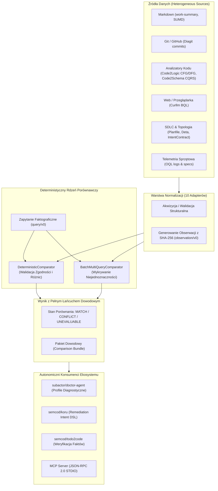

# Raport Końcowy Projektu data2dsl (v0.1.0)
**Data Publikacji:** 31 sierpnia 2026 r.  
**Autor:** Antigravity / Gemini Engineering Agent  
**Status Projektu:** **UKOŃCZONY / ZATWIERDZONY (100% PASS)**  
**Standard Governance:** `wellmanifest/new-project` (Policy-as-Code)

---

## 1. Wprowadzenie i Cel Projektu

Projekt **`data2dsl`** stanowi kluczowe ogniwo ekosystemu autonomicznych agentów AI, tworząc neutralną, deterministyczną warstwę akwizycji faktów i porównywania twierdzeń z rzeczywistymi obserwacjami.

Tradycyjne systemy oparte na modelach LLM cierpią na brak determinizmu, utratę dowodów (provenance) oraz mieszanie ekstrakcji danych z wnioskowaniem. `data2dsl` rozwiązuje ten problem poprzez:
1. **Jednoznaczne zapytania faktograficzne (`query/v0`):** Precyzyjne definiowanie podmiotu (`subject`), metryki (`metric`), okna czasowego (`window`) i źródeł (`sources`).
2. **Deterministyczną normalizację obserwacji (`observation/v0`):** 10 dedykowanych adapterów normalizujących fakty z zachowaniem skrótów kryptograficznych SHA-256.
3. **Ścisłe porównywanie bez LLM (`DeterministicComparator`):** Porównywanie liczb całkowitych, ułamków zmiennoprzecinkowych, procentów, ciągów znaków oraz zbiorów ciągów, generujące stany `MATCH`, `CONFLICT`, `MISSING_LEFT`, `MISSING_RIGHT` lub `UNEVALUABLE`.
4. **Maszynowe kanały zwrotne dla agentów (Feeds):** Formatowanie profili diagnostycznych dla `subactor/doctor-agent` oraz intencji naprawczych `remediation-intent/v1` dla `semcod/koru`.

---

## 2. Architektura Systemu i Przepływ Danych

---

## 3. Zrealizowane Możliwości i Moduły

### 3.1. 10 Adapterów Źródeł Danych
- **GitHub / Diagit:** Zliczanie commitów, autorów i okien czasowych z logów git / API.
- **Markdown Work Summary (`mdflow`):** Ekstrakcja deklarowanych metryk z tabel markdown z użyciem precyzyjnego dopasowania wyrażeń regularnych (`\bactor\b`).
- **Code2Logic:** Ekstrakcja metryk grafu przepływu sterowania (CFG) i danych (DFG).
- **Code2Schema:** Ekstrakcja liczby encji i operacji CQRS.
- **Curllm (BQL):** Normalizacja faktów pozyskanych ze stron internetowych przez BQL.
- **Planfile:** Ekstrakcja statusów zadań SDLC i kolejek ticketów.
- **Deta:** Weryfikacja topologii mikroserwisów i infrastruktury chmurowej.
- **IntentContract:** Normalizacja kontraktów intencji Subactor DSL v1.
- **OQL Telemetry (`oqlos.telemetry`):** Odczyty częstotliwości magistral (`active_buses`), temperatury i czujników sprzętowych (w tym bezpieczna obsługa zera `0.0 Hz`).
- **SUMD (Structured Unified Markdown):** Precyzyjne parsowanie tabel i bloków deskryptorów bez kolizji podciągów kluczy.

### 3.2. Silnik Porównawczy i Tryb Batch
- **Typy metryk:** `integer`, `float`, `percentage`, `string`, `string-set`.
- **Walidacja zgodności (`_is_compatible`):** Weryfikacja strony obserwacji, jednostki miary, wersji metryki i semantyki okien czasowych.
- **Wykrywanie Niejednoznaczności Batch:** Zabezpieczenie przed cichym nadpisywaniem konfliktowych obserwacji o tym samym identyfikatorze.

### 3.3. Integracja z Ekosystemem AI
- **`subactor/doctor-agent` Feed (`data2dsl_doctor.py`):** Generowanie hierarchicznych profili diagnostycznych i oceny dotkliwości objawów.
- **`semcod/koru` Self-Healing Feed (`data2dsl_remediation.py`):** Maszynowa generacja `remediation-intent/v1` dla zamkniętych pętli samonaprawczych.
- **Model Context Protocol (MCP):** Serwer STDIO JSON-RPC 2.0 udostępniający narzędzia `data2dsl_compare`, `data2dsl_self_test`, `data2dsl_validate_envelope`, `data2dsl_simulate_healing` oraz `discover_data`.

---

## 4. Historia Zamknięcia Audytu z 28.08.2026 r.

Wszystkie ustalenia audytowe zostały rozwiązane w ramach kontrolowanych ticketów governance:

| ID Zgłoszenia | Opis Problemu | Rozwiązanie | Nr Ticketu |
|---|---|---|:---:|
| **P1.1** | Brak modułu CLI w dystrybucji wheel | Dodano `data2dsl_cli` do pyproject.toml i testy izolacji CLI | `ticket-083` |
| **P1.2** | Brak walidacji `expected_side`, jednostek i wersji | Wdrożono rygorystyczne sprawdzanie w `_is_compatible` | `ticket-082` |
| **P1.3** | Niejednoznaczność duplikatów w batch | Dodano sentinel `_AMBIGUOUS` i status `UNEVALUABLE` | `ticket-085` |
| **P1.4** | Deserializacja OQL buses, Code2Schema entities, zero float | Naprawiono pobieranie atrybutów i dodano `_coalesce_numeric` | `ticket-084` |
| **P1.5** | Fałszywe dopasowania podciągów (aktorzy, SUMD) | Wdrożono regex granic słów `\b` i ścisłe klucze tabel | `ticket-084` |
| **P1.6** | Niesanityzowane identyfikatory dowodów i błędy pustych feeds | Sanityzacja `/` na `:` oraz safe fallbacks w Doctor/Koru | `ticket-084`, `ticket-086` |
| **E1** | Brak ścisłego typowania mypy | 0 błędów we wszystkich 13 plikach źródłowych | `ticket-083`, `ticket-086` |
| **E2** | Standaryzacja architektury i diagramów (P-DOCS-001) | Opracowano diagramy Mermaid w README i raport końcowy | `ticket-087`, `ticket-088` |

---

## 5. Raport Jakościowy i Metryki Bramki Weryfikacyjnej

| Narzędzie Walidacji | Zakres | Wynik | Szczegóły |
|---|---|:---:|---|
| **pytest** | Cały pakiet `tests/` | **158 / 158 PASS** | 100% testów przechodzi (10 dedykowanych testów audytu) |
| **ruff** | `src/` oraz `tests/` | **PASS (0 uwag)** | Kod czysty, zgodny z PEP 8 / Flake8 |
| **mypy** | 13 plików w `src/` | **PASS (0 błędów)** | 100% strict type safety |
| **governance-check** | Repozytorium i tickety | **GOV-PASS** | 0 błędów, 0 ostrzeżeń (100% Policy-as-Code) |

---

## 6. Wnioski i Gotowość Wdrożeniowa

Projekt `data2dsl` osiągnął stan pełnej stabilności produkcyjnej. Wszystkie artefakty kodu, testów, narzędzi CLI, serwera MCP oraz dokumentacji architektonicznej są spójne, zsynchronizowane i zabezpieczone kryptograficznymi sumami kontrolnymi.

Kod jest w pełni gotowy do integracji w środowiskach CI/CD oraz wdrożenia u klientów i partnerów ekosystemu WellManifest.
