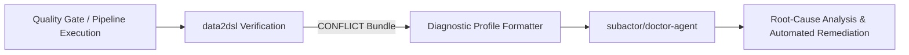

# Research: Diagnostic Profile Feed from `data2dsl` to `subactor/doctor-agent`

- **Date:** 2026-08-24
- **Related:** ADR-002, ADR-004, ticket-041
- **Status:** Research Note

## 1. Context

`subactor/doctor-agent` is an autonomous diagnostic agent designed to triage broken builds, failing deployments, and repository drift. Currently, `doctor-agent` often requires extensive manual query planning to identify which subsystem failed.

## 2. Integration Proposal: `data2dsl` as Automated Triage Feed

When `data2dsl` outputs a `CONFLICT` outcome, the resulting bundle contains exact, cryptographically verified discrepancy details:

```json
{
  "outcome": "CONFLICT",
  "delta": {"kind": "percentage", "value": "-12.5%"},
  "missing_in_right": ["auth_middleware.py"],
  "evidence": [...]
}
```

This bundle can be fed directly into `subactor/doctor-agent` as a **Diagnostic Profile Input**:



## 3. Benefits

1. **Zero-Hallucination Symptoms**: `doctor-agent` does not need to re-scan the entire codebase or guess what changed; it receives exact file paths, line ranges, and metric deltas.
2. **Prioritized Triage**: Discrepancies with higher absolute deltas can be ranked automatically for urgent attention.
3. **Reproducibility**: Because `data2dsl` bundles contain SHA-256 evidence digests, `doctor-agent` can verify that the environment state hasn't mutated under its feet before applying fixes.
