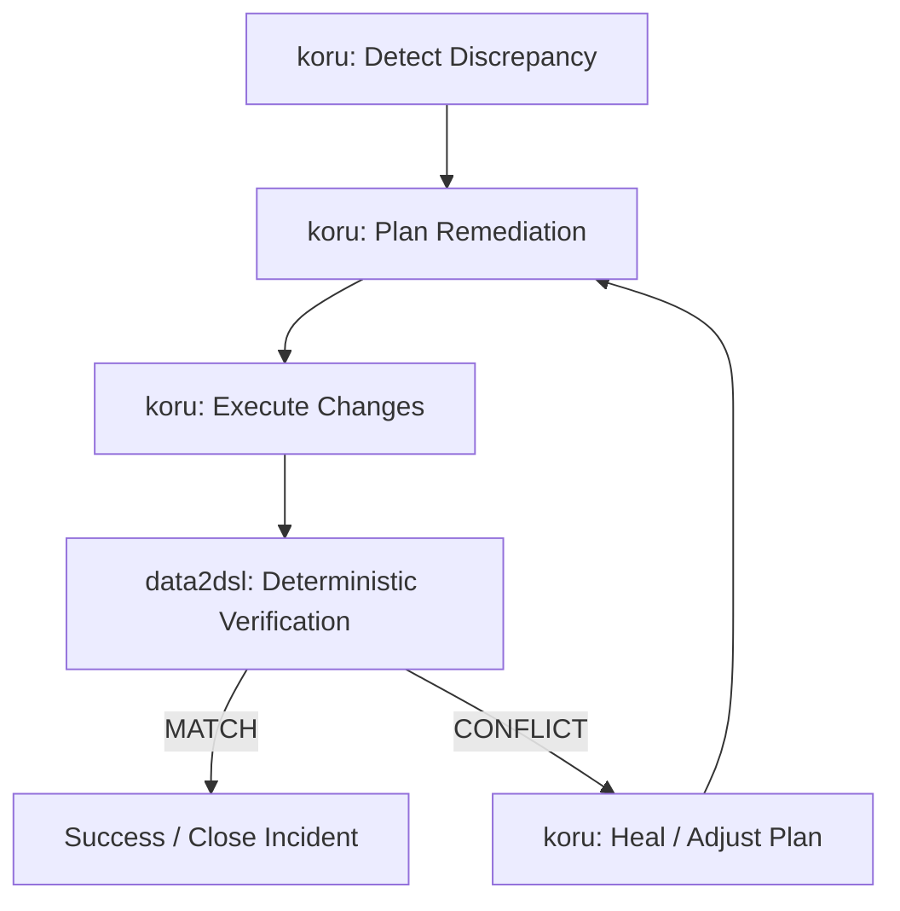

# Research: data2dsl Integration with `semcod/koru` Closed-Loop Self-Healing

- **Date:** 2026-08-24
- **Related:** ADR-002, ADR-004, ticket-041
- **Status:** Research Note

## 1. Executive Summary

`semcod/koru` provides an autonomous repair framework structured around the classic feedback loop:
```
DETECT → PLAN → EXECUTE → VERIFY → HEAL
```
This note evaluates how `data2dsl` fits into the **`VERIFY`** phase as a deterministic, zero-hallucination verification engine.

## 2. Integration Seam

In traditional agent workflows, verification is often performed by LLMs prompting on diffs, introducing nondeterminism and hallucinated passes. `data2dsl` provides an immutable verification oracle:



## 3. Data Flow and Contract

1. **Input to data2dsl**: `koru` submits a comparison query pairing the desired target contract (`left_source`: declared schema / ticket requirement) with post-execution telemetry (`right_source`: code AST, test coverage, or GitHub commit facts).
2. **Execution**: `data2dsl` runs offline via `Data2DslSkill.execute_compare` or `data2dsl://host/compare/run`.
3. **Output to koru**:
   - `MATCH`: `koru` terminates the healing loop with cryptographic verification proof.
   - `CONFLICT`: `koru` receives structured, typed deltas (e.g. `missing: ["endpoint_b"]`, `delta: "-5.0%"`) to guide the next repair cycle directly without guessing.

## 4. Key Invariants

- **Fail-closed verification:** `UNEVALUABLE` or missing observations are treated by `koru` as failed verification, preventing premature completion.
- **Audit trail:** The resulting `result/v0` comparison bundle contains SHA-256 digests of all observed facts, providing non-repudiation for automated remediations.
